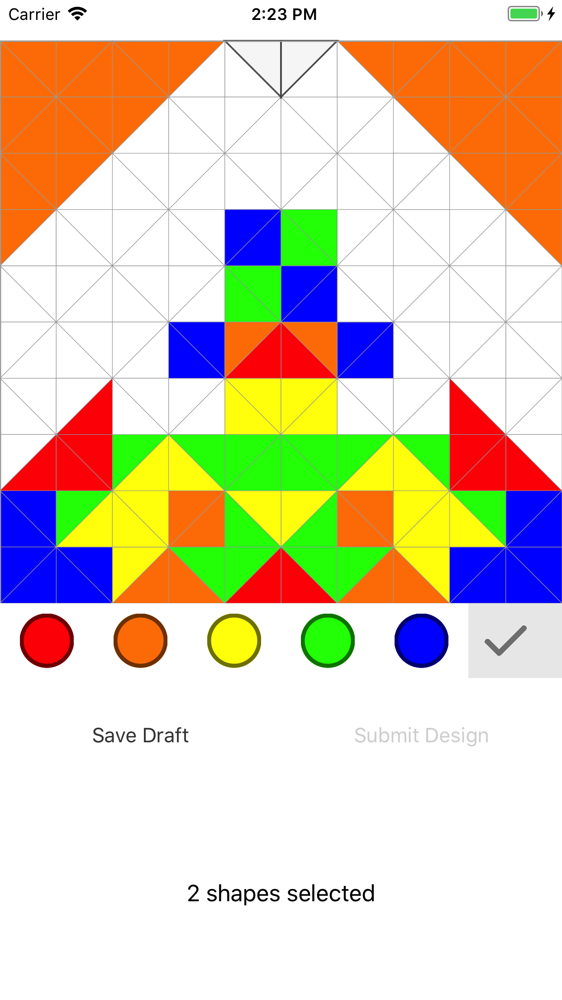

# Creative Kind IOS
Creative Kind Prototype in iOS, created as an exercise to learn more about Swift. Creative Kind is a non-profit initiative by Monika Ghobrial, a community driven art project to help those in need.
The project is a community driven colouring book, with all proceeds going to non-profit organizations.

## Requirements
This project requires [Xcode](https://developer.apple.com/xcode/) and [cocapods](https://guides.cocoapods.org/using/getting-started.html) to be installed on the system.

## Getting Started
1. Clone the project and run `pod install` from the project root.
2. After all pods have been installed, open `creative-kind.xcworkspace`
